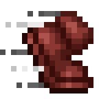

# Auto Walk

A minecraft mod based on Forge that allows players to auto walk by simply pressing a configurable toggle key without holding down the 'W'.

---

The mod is based on the Quark implementation of "Auto Walk Keybind". Thanks to Vazkii ;)

Quark's source: https://github.com/VazkiiMods/Quark

---

Fabric one can be found here (by Emonadeo): https://www.curseforge.com/minecraft/mc-mods/autorun-fabric